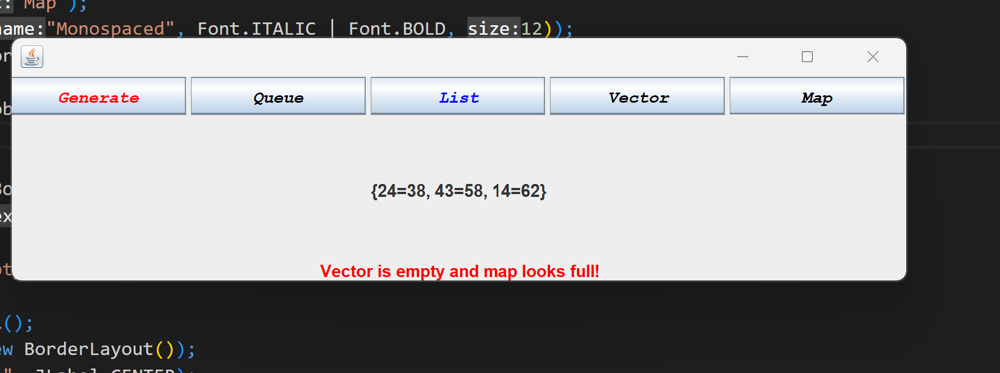
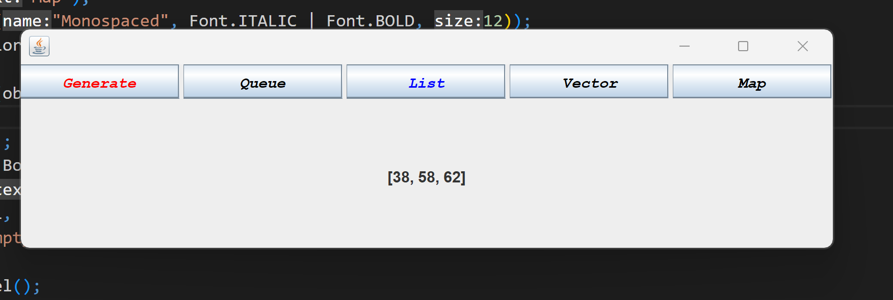
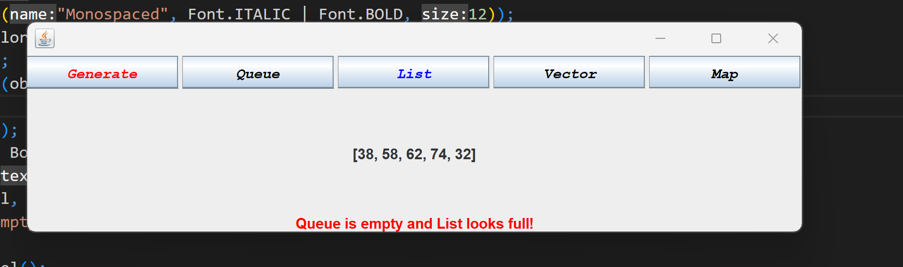

# Java-Collections-Simulation

## Program Overview

This Java program creates a GUI application that generates random numbers and stores them in various data structures. The data structures used are:

- Stack
- Queue
- ArrayList
- Vector
- HashMap

The GUI interface consists of five buttons, each of which corresponds to one of the data structures. When a button is clicked, the program generates five random numbers and stores them in the corresponding data structure. The generated numbers are then displayed on the GUI.

## Requirements

- Java Development Kit (JDK) version 8 or above
- Java IDE (Integrated Development Environment) such as Eclipse or IntelliJ IDEA

## How to run the program

- Open the Java IDE.
- Open the GraphicCollection.java file.
- Compile and run the program.

## How to use the program

- Click on one of the five buttons to generate random numbers and store them in the corresponding data structure.
- The generated numbers will be displayed on the GUI.
## Program Details
The GraphicCollection class extends the JFrame class and creates the GUI interface. The init() method initializes the GUI components and data structures. The main() method creates an instance of the GraphicCollection class and runs the program.

The Click class extends the MouseAdapter class and listens for mouse clicks on the buttons. When a button is clicked, the mouseClicked() method generates random numbers and stores them in the corresponding data structure. The generated numbers are then displayed on the GUI.

## Sample Output

